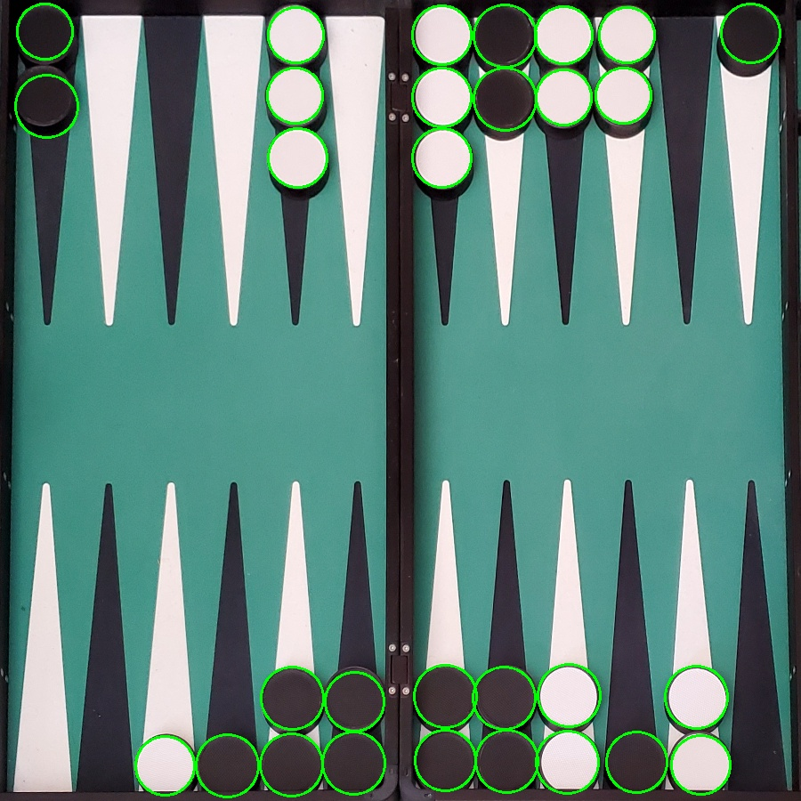

# Backgammon checker detection openCV

## Pipeline:

1. Reads the image
2. Uses the given corners and dimensions to remove the perspective from the image (i.e. find a homography and perspective transform), into an image where the checkers are all circular.
3. Use hough circles to locate the checkers on the board
4. Output a visual feedback image drawing the located checkers
5. Count the number of checkers on each "pip" (each triangle) on the board, and output this as a JSON

Input:


Output:


## Results:

matching pips pct:  90.00%

full matches pct:   40.00%

## Instructions

* Install dependencies:

```pip install -r requirements.txt```

* Run like this:
    ```python warp_and_find_checkers.py <input_path> <output_path>```
